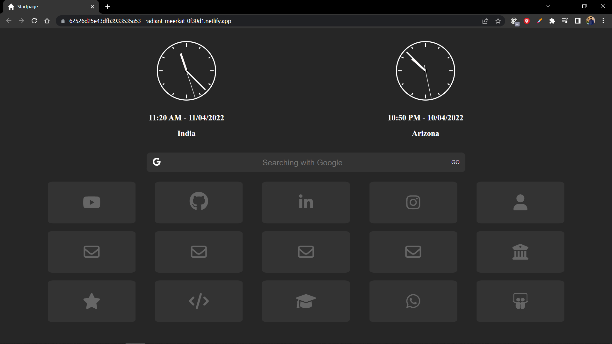

<h1>Customized HomePage for Your Browser</h1>

  
  

## About
Customized HomePage is a minimalistic and simp startpage with a navigation bar with 4 search engines and icons as buttons redirecting to desired site.

 Hosted version of the webpage - <a href="https://62526a13b201ff32bb437466--magnificent-crostata-541762.netlify.app/">Netlify</a> and <a href="https://smitpatel910.github.io/Starthome-main/">Github-Pages</a>

## Preview

