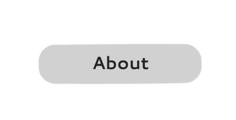

<h1>Starthome</h1>

## About

Starthome is a minimalistic and simp startpage/homepage with a navigation bar with 4 search engines and icons as buttons redirecting to desired site.

## Preview

 Hosted version of the webpage - 

## Setup

<h2>Local</h2>

<ul>

Same thing but enter the url of the website (https://starthome.netlify.app) in the url box while editing the extension settings

